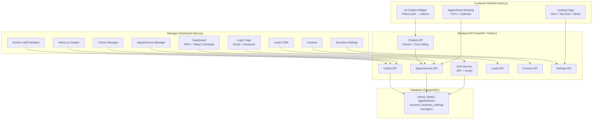
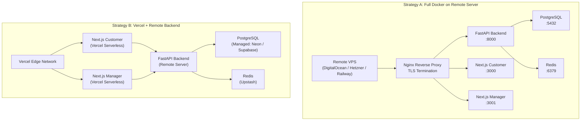
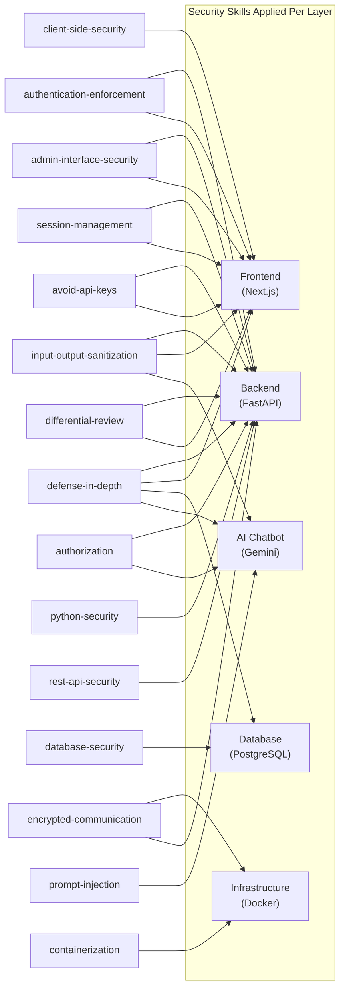

# FRIZURA V2 — Full Web Platform Upgrade

> **Converting a desktop CustomTkinter salon management app into a full-stack web platform** with a customer-facing website, manager dashboard, AI chatbot, and modern authentication.

## Visual Design Direction

````carousel

<!-- slide -->

<!-- slide -->

````

---

## Background & Current State

FRIZURA is a **boutique hair salon management system** currently running as a **Python desktop application** (CustomTkinter GUI + SQLite). It features:

- **6 management modules:** Appointments, Clients, Leads CRM, History/Dossier, Deleted Archive, Business Settings
- **Layered architecture:** `UI (gui.py)` → `Core (CRMManager, OperationsManager)` → `Database (DBManager + SQLite)`
- **Key business logic:** 60-minute appointment collision detection, soft-delete cascading via SQL triggers, lead-to-client conversion, invoice generation, configurable services/hours/employees
- **Database:** 5 tables (`clients`, `leads`, `appointments`, `invoices`, `business_settings`) with a singleton pattern for settings

The clean separation between UI and business logic makes this an ideal candidate for web migration — **the Core and Database layers can be wrapped with a REST API without rewriting business rules**.

---

## User Review Required

> [!IMPORTANT]
> **Two separate web applications** will be built under one monorepo — a **customer-facing website** and a **manager dashboard**. They share the same backend API but have completely different auth flows, designs, and deployment targets.

> [!WARNING]
> **Database migration:** The current SQLite database will need to be migrated to **PostgreSQL** for production web deployment (concurrent connections, cloud hosting). The SQLite `soft_delete_client_cascade` trigger must be rewritten as a PostgreSQL trigger or moved into application-level logic.

> [!NOTE]
> **~~AI Chatbot~~ — RESOLVED: Completely Free.** The chatbot uses **Google Gemini 2.0 Flash** via the free tier (1,500 requests/day, 1M tokens/day — more than enough for a boutique salon). As a zero-cost fallback, **Ollama** can run open-source models (e.g., Llama 3.1 8B) locally on the server at no API cost whatsoever. See [Component 3: AI Chatbot](#component-3-ai-chatbot-agent).

---

## Open Questions

> [!NOTE]
> **~~1. Deployment Target~~ — RESOLVED:** Remote server deployment with **Vercel as optional** for the Next.js frontends. See [Component 6: Deployment & Infrastructure](#component-6-project-infrastructure) for the dual-strategy architecture.

> [!IMPORTANT]
> **2. Domain & Branding:** Do you already have a domain name (e.g., `frizura.co.il`)? Should we design for both Hebrew (RTL) and English?

> [!IMPORTANT]
> **3. SMS/OTP Provider:** The AI chatbot authenticates customers via phone number. Should we use:
> - Simple phone lookup (match against DB — no SMS verification)
> - Full OTP via SMS provider (e.g., Twilio, Firebase Auth phone)

> [!IMPORTANT]
> **4. Payment Integration:** Current invoices are manual. Should we integrate online payments (e.g., PayPlus, Meshulam, Stripe)?

---

## Architecture Overview



---

## Proposed Changes

### Component 1: Backend API (FastAPI + PostgreSQL)

> The Python backend wraps the existing `CRMManager` and `OperationsManager` logic into REST endpoints, adds JWT authentication for managers, and exposes a chatbot orchestration endpoint.

---

#### [NEW] `backend/` — FastAPI Application Root

```
backend/
├── main.py                    # FastAPI app, CORS, lifespan
├── requirements.txt           # Dependencies
├── alembic/                   # DB migrations
│   └── versions/
├── alembic.ini
├── config.py                  # Environment config (DB URL, JWT secret, chatbot provider)
├── database/
│   ├── connection.py          # AsyncPG connection pool / SQLAlchemy async engine
│   ├── models.py              # SQLAlchemy ORM models (all 6 tables)
│   └── schema.sql             # PostgreSQL schema (migrated from SQLite)
├── auth/
│   ├── router.py              # POST /auth/login, POST /auth/register
│   ├── service.py             # bcrypt hashing, JWT encode/decode
│   ├── dependencies.py        # get_current_manager dependency
│   └── schemas.py             # Pydantic: LoginRequest, TokenResponse, ManagerCreate
├── routers/
│   ├── appointments.py        # CRUD + collision detection (port from OperationsManager)
│   ├── clients.py             # CRUD + soft-delete/restore (port from CRMManager)
│   ├── leads.py               # CRUD + convert-to-client (port from CRMManager)
│   ├── invoices.py            # Create + list by client
│   ├── settings.py            # GET/PUT business settings (singleton)
│   └── chatbot.py             # POST /chatbot/message — Gemini orchestration
├── services/
│   ├── crm_service.py         # Business logic: client & lead operations
│   ├── operations_service.py  # Business logic: appointments & invoices
│   └── chatbot_service.py     # Gemini function-calling agent logic
└── schemas/
    ├── appointment.py         # Pydantic request/response models
    ├── client.py
    ├── lead.py
    ├── invoice.py
    └── settings.py
```

#### Key API Endpoints

| Method | Endpoint | Auth | Description |
|--------|----------|------|-------------|
| `POST` | `/auth/login` | None | Manager login → JWT token |
| `POST` | `/auth/register` | Manager | Create new manager account |
| `GET` | `/api/appointments` | Manager | List active appointments (with client join) |
| `POST` | `/api/appointments` | Manager / Public | Book appointment (60-min collision check) |
| `PATCH` | `/api/appointments/{id}/status` | Manager | Update status (ממתין/בוצע/בוטל) |
| `DELETE` | `/api/appointments/{id}` | Manager | Soft-delete appointment |
| `GET` | `/api/appointments/deleted` | Manager | List archived appointments |
| `GET` | `/api/clients` | Manager | List active clients |
| `POST` | `/api/clients` | Manager / Public | Add client (from booking form or manager) |
| `DELETE` | `/api/clients/{id}` | Manager | Soft-delete client (cascade) |
| `POST` | `/api/clients/{id}/restore` | Manager | Restore client + cascade |
| `GET` | `/api/clients/{id}/history` | Manager | Appointments + invoices for client |
| `GET` | `/api/leads` | Manager | List active leads |
| `POST` | `/api/leads` | Manager | Add lead |
| `PATCH` | `/api/leads/{id}/status` | Manager | Update lead status |
| `POST` | `/api/leads/{id}/convert` | Manager | Convert lead → client (atomic) |
| `POST` | `/api/invoices` | Manager | Create invoice |
| `GET` | `/api/settings` | Public (read) | Get salon info, services, hours |
| `PUT` | `/api/settings` | Manager | Update business settings |
| `POST` | `/api/chatbot/message` | Public | Send message to AI chatbot |
| `POST` | `/api/chatbot/auth` | Public | Verify customer phone number |

#### [NEW] `backend/database/models.py` — PostgreSQL ORM Models

New table added for manager authentication:

```python
class Manager(Base):
    __tablename__ = "managers"
    id: int           # PK
    email: str        # UNIQUE, NOT NULL
    password_hash: str # bcrypt hashed
    name: str
    role: str         # 'admin' | 'manager'
    created_at: datetime
```

All existing tables (`clients`, `leads`, `appointments`, `invoices`, `business_settings`) are ported from SQLite schema with these PostgreSQL enhancements:
- `TEXT` date/time columns → proper `DATE` and `TIME` types
- JSON string columns (`employees`, `working_hours`, `services`) → native `JSONB`
- Trigger `soft_delete_client_cascade` → PostgreSQL `CREATE TRIGGER` + `CREATE FUNCTION`

---

### Component 2: Customer-Facing Website (Next.js + Tailwind CSS)

> The public website for customers to discover services, book appointments, and interact with the AI chatbot. Designed with **UI/UX Pro Max Skill** design intelligence for a premium boutique salon aesthetic.

---

#### [NEW] `frontend/customer/` — Next.js Application

```
frontend/customer/
├── app/
│   ├── layout.tsx             # Root layout: RTL, Hebrew fonts, metadata
│   ├── page.tsx               # Landing page: Hero + Services + About + CTA
│   ├── book/
│   │   └── page.tsx           # Appointment booking form
│   └── globals.css            # Tailwind + custom design tokens
├── components/
│   ├── Navbar.tsx             # FRIZURA logo + nav links + Book CTA
│   ├── Hero.tsx               # Full-width hero with salon imagery
│   ├── ServicesGrid.tsx       # Service cards with icons & descriptions
│   ├── BookingForm.tsx        # Multi-step form: service → date → time → info
│   ├── ChatWidget.tsx         # Floating AI chatbot (bottom-right)
│   ├── ChatMessage.tsx        # Individual message bubble component
│   ├── TimeSlotPicker.tsx     # Available slots grid with collision-aware API
│   └── Footer.tsx             # Contact info, hours, social links
├── lib/
│   ├── api.ts                 # Fetch wrapper for backend API
│   └── chatbot.ts             # Chatbot state machine & message handling
├── tailwind.config.ts         # Design system tokens from UI/UX Pro Max
├── next.config.ts
└── package.json
```

#### Design System (via UI/UX Pro Max Skill)

| Token | Value | Usage |
|-------|-------|-------|
| **Primary** | `#1a2332` (Deep Navy) | Navbar, headers, sidebar |
| **Accent** | `#c9a962` (Warm Gold) | CTAs, highlights, active states |
| **Surface** | `#f5f0e8` (Soft Cream) | Card backgrounds, chatbot user bubbles |
| **Background** | `#ffffff` | Main content area |
| **Text Primary** | `#1a2332` | Body text |
| **Text Muted** | `#6b7280` | Captions, secondary text |
| **Success** | `#22c55e` | Confirmed status |
| **Warning** | `#eab308` | Pending status |
| **Danger** | `#ef4444` | Cancelled / error |
| **Font Heading** | `Playfair Display` (serif) | h1–h3, brand, elegant feel |
| **Font Body** | `Inter` (sans-serif) | Body text, forms, UI |
| **Border Radius** | `12px` cards, `24px` buttons | Soft, welcoming aesthetic |

#### Customer Website Pages

**1. Landing Page (`/`)**
- Hero section: Full-width salon imagery, tagline in Hebrew, prominent "הזמן תור" (Book Now) gold button
- Services grid: Dynamic cards pulled from `/api/settings` → `services` list
- About section: Salon description, team, working hours (from `business_settings`)
- Contact / Map section
- Floating AI Chatbot widget (bottom-right corner)

**2. Booking Page (`/book`)**
- Multi-step form with progress indicator:
  - **Step 1:** Select service (from `business_settings.services`)
  - **Step 2:** Pick date (calendar widget respecting `working_hours`)
  - **Step 3:** Pick time slot (API checks availability — 60-min collision rule)
  - **Step 4:** Customer info (name, phone, email — creates client if new)
  - **Step 5:** Confirmation summary
- On submit: `POST /api/appointments` + `POST /api/clients` (if new customer)

---

### Component 3: AI Chatbot Agent (💰 Completely Free)

> A conversational AI agent embedded in the customer website — **at zero cost**. Uses the Gemini API free tier as the primary provider, with Ollama (self-hosted open-source models) as a fully offline fallback. Authenticates via phone number lookup, then can schedule, cancel, or query appointments.

---

#### Free LLM Strategy

> [!TIP]
> The chatbot is designed with a **provider abstraction layer** — the same chatbot logic works with any LLM backend. Switch between providers by changing a single environment variable. No code changes needed.

| Provider | Model | Cost | Limits (Free Tier) | Function Calling | Recommendation |
|----------|-------|------|-------------------|-----------------|----------------|
| **Gemini API** | Gemini 2.0 Flash | **\$0** | 1,500 req/day, 1M tokens/day, 15 RPM | ✅ Native | **Primary — best quality + free** |
| **Ollama** | Llama 3.1 8B / Mistral 7B | **\$0** | Unlimited (runs on your server) | ✅ Via tool format | **Fallback — fully self-hosted** |
| **Groq** | Llama 3.1 70B | **\$0** | 30 req/min, 14.4K req/day | ✅ Native | Alternative free cloud option |

**Why is the free tier more than enough?**
A boutique salon with ~20 customers/day chatting an average of 5 messages each = **~100 messages/day**. The Gemini free tier allows **1,500 requests/day** — that's **15x headroom**.

#### [NEW] `backend/services/chatbot_service.py` — LLM Provider Abstraction

```python
# Provider abstraction — switch via CHATBOT_PROVIDER env var
class ChatbotService:
    def __init__(self):
        provider = os.getenv("CHATBOT_PROVIDER", "gemini")  # "gemini" | "ollama" | "groq"
        if provider == "gemini":
            self.client = GeminiProvider(api_key=os.getenv("GEMINI_API_KEY"))
        elif provider == "ollama":
            self.client = OllamaProvider(base_url=os.getenv("OLLAMA_URL", "http://ollama:11434"))
        elif provider == "groq":
            self.client = GroqProvider(api_key=os.getenv("GROQ_API_KEY"))
```

#### [NEW] `backend/services/providers/` — Free LLM Providers

```
backend/services/providers/
├── base.py              # Abstract LLMProvider interface
├── gemini_provider.py   # Google Gemini 2.0 Flash (free tier)
├── ollama_provider.py   # Self-hosted Ollama (Llama 3.1 / Mistral)
└── groq_provider.py     # Groq cloud (free tier)
```

Each provider implements the same interface:
```python
class LLMProvider(ABC):
    async def chat(self, messages: list, tools: list) -> ChatResponse: ...
    async def function_call(self, messages: list, tools: list) -> ToolCallResponse: ...
```

#### Ollama Self-Hosted Setup (Zero-Cost Guarantee)

For **absolute zero cost** with no API dependency, add Ollama to the Docker stack:

```yaml
# docker-compose.yml — add this service
  ollama:
    image: ollama/ollama:latest
    volumes: ["ollama_data:/root/.ollama"]
    deploy:
      resources:
        limits:
          memory: 4G    # Llama 3.1 8B needs ~4GB RAM
    # Pull model on first run:
    # docker exec ollama ollama pull llama3.1:8b
```

Set `CHATBOT_PROVIDER=ollama` and `OLLAMA_URL=http://ollama:11434` — the chatbot runs entirely on your server with no external API calls.

#### Authentication Flow
1. Bot greets customer → asks for phone number
2. Customer provides phone → `POST /api/chatbot/auth` → looks up `clients.phone`
3. If found: Bot unlocks full capabilities tied to that `client_id`
4. If not found: Bot offers to create a new profile or continue as guest

#### Available Tool Functions (Function Calling)

| Function | Description | Parameters |
|----------|-------------|------------|
| `get_available_slots` | Check available time slots for a date | `date`, `service_type` |
| `book_appointment` | Schedule a new appointment | `client_id`, `service_type`, `date`, `time` |
| `cancel_appointment` | Cancel an existing appointment | `appointment_id` |
| `get_my_appointments` | List customer's upcoming appointments | `client_id` |
| `get_services` | List all available salon services | — |
| `get_working_hours` | Get salon schedule | — |

#### Conversation Context
- Session state stored server-side (Redis or in-memory dict)
- Each session tracks: `client_id` (after auth), `conversation_history`, `pending_action`
- The bot speaks Hebrew by default, with system prompt enforcing polite, professional salon tone

---

### Component 4: Manager Dashboard (Next.js + Tailwind CSS)

> The existing desktop GUI converted to a modern web admin panel. All 6 management modules replicated with enhanced UX.

---

#### [NEW] `frontend/manager/` — Next.js Application

```
frontend/manager/
├── app/
│   ├── layout.tsx             # Dashboard shell: sidebar + topbar
│   ├── login/
│   │   └── page.tsx           # Manager login form
│   ├── dashboard/
│   │   └── page.tsx           # KPI cards + today's schedule
│   ├── appointments/
│   │   └── page.tsx           # Appointments table + CRUD modals
│   ├── clients/
│   │   └── page.tsx           # Clients table + add/delete/invoice
│   ├── leads/
│   │   └── page.tsx           # Leads CRM table + convert flow
│   ├── history/
│   │   └── page.tsx           # Client dossier: appointments + invoices
│   ├── archive/
│   │   └── page.tsx           # Soft-deleted clients + restore
│   ├── invoices/
│   │   └── page.tsx           # Invoice list + creation
│   └── settings/
│       └── page.tsx           # Business settings: info, staff, hours, services
├── components/
│   ├── Sidebar.tsx            # RTL sidebar with nav links + icons
│   ├── TopBar.tsx             # Search, notifications, manager avatar
│   ├── DataTable.tsx          # Reusable sortable/filterable table
│   ├── StatCard.tsx           # KPI metric card
│   ├── Modal.tsx              # Reusable modal dialog
│   ├── StatusBadge.tsx        # Color-coded status pill
│   ├── CalendarWidget.tsx     # Mini month calendar
│   └── forms/
│       ├── AppointmentForm.tsx
│       ├── ClientForm.tsx
│       ├── LeadForm.tsx
│       ├── InvoiceForm.tsx
│       └── SettingsForm.tsx
├── lib/
│   ├── api.ts                 # Authenticated API client (JWT in headers)
│   ├── auth.ts                # Login, token storage, refresh
│   └── hooks/
│       ├── useAppointments.ts # SWR/React Query hooks
│       ├── useClients.ts
│       ├── useLeads.ts
│       └── useSettings.ts
├── middleware.ts              # Route protection: redirect to /login if no JWT
└── package.json
```

#### Module-by-Module Migration Map

| Desktop Tab (CustomTkinter) | Web Route | Key Changes |
|---|---|---|
| `📅 ניהול תורים` | `/appointments` | Data table with inline status badges, modal for add/edit, calendar sidebar |
| `👥 ניהול לקוחות` | `/clients` | Searchable table, click-to-expand dossier, inline invoice creation |
| `🌱 ניהול לידים (CRM)` | `/leads` | Pipeline view with status columns, one-click conversion with confirmation |
| `📂 היסטוריה ותיק לקוח` | `/history` | Split view: appointments table (top) + invoices table (bottom), client selector |
| `🗑️ ארכיון מחוקים` | `/archive` | Archived clients list, expand to see cascaded appointments/invoices, restore button |
| `⚙️ הגדרות העסק` | `/settings` | Tabbed form: General Info, Staff & Services (dynamic lists), Working Hours (7-day grid) |
| *(new)* | `/dashboard` | **New!** KPI overview: today's appointments count, pending/completed, daily revenue |
| *(new)* | `/invoices` | **New!** Dedicated invoice management with filtering and export |

---

### Component 5: Manager Authentication System

> New credential-based auth system for manager/admin access to the dashboard.

---

#### [NEW] `backend/auth/` — JWT Authentication

**Registration Flow (admin-only):**
1. Existing admin calls `POST /auth/register` with `{ email, password, name, role }`
2. Password is hashed with `bcrypt` (12 rounds)
3. Manager record created in `managers` table

**Login Flow:**
1. Manager submits `POST /auth/login` with `{ email, password }`
2. Server verifies bcrypt hash
3. Returns JWT access token (24h expiry) + refresh token (7d expiry)
4. Frontend stores tokens in `httpOnly` cookies

**Route Protection:**
- All `/api/*` manager endpoints require `Authorization: Bearer <JWT>` header
- FastAPI `Depends(get_current_manager)` dependency extracts and validates JWT
- Public endpoints (booking, chatbot, settings read) are explicitly excluded

---

### Component 6: Project Infrastructure

#### [NEW] `docker-compose.yml` — Development & Production Stack

```yaml
services:
  backend:
    build: ./backend
    ports: ["8000:8000"]
    depends_on: [db, redis]
    environment:
      - DATABASE_URL=postgresql://...
      - JWT_SECRET=...
      - GEMINI_API_KEY=...
    read_only: true
    tmpfs: ["/tmp"]
    cap_drop: ["ALL"]
    user: "10001"

  customer:
    build: ./frontend/customer
    ports: ["3000:3000"]
    user: "node"

  manager:
    build: ./frontend/manager
    ports: ["3001:3001"]
    user: "node"

  db:
    image: postgres:16-alpine
    volumes: ["pgdata:/var/lib/postgresql/data"]

  redis:
    image: redis:7-alpine  # For chatbot session state + JWT blocklist

  nginx:
    image: nginx:alpine
    ports: ["80:80", "443:443"]
    volumes:
      - ./nginx/nginx.conf:/etc/nginx/nginx.conf:ro
      - ./nginx/certs:/etc/nginx/certs:ro
    depends_on: [backend, customer, manager]
```

#### [NEW] Monorepo Structure

```
FRIZURA/
├── backend/                   # FastAPI + Python
│   ├── Dockerfile
│   └── ...
├── frontend/
│   ├── customer/              # Next.js — public website
│   │   ├── Dockerfile
│   │   └── ...
│   └── manager/               # Next.js — admin dashboard
│       ├── Dockerfile
│       └── ...
├── nginx/
│   └── nginx.conf             # Reverse proxy + TLS termination
├── docker-compose.yml         # Local dev & remote server
├── docker-compose.prod.yml    # Production overrides
├── .github/
│   └── workflows/
│       └── deploy.yml         # CI/CD pipeline
├── .env.example
├── vercel.json                # Optional Vercel config (frontends only)
├── README.md
└── legacy/                    # Archived desktop app (current codebase)
    ├── core/
    ├── database/
    ├── ui/
    └── __main__.py
```

---

### Deployment Strategy: Remote Server + Vercel (Optional)

The project supports **two deployment strategies** that can be mixed:



#### Strategy A: Full Docker on Remote Server (Recommended)

> Everything runs on a single VPS behind Nginx. Simplest to manage, lowest cost, full control.

| Component | How It Runs | Port |
|-----------|------------|------|
| **Nginx** | Reverse proxy + TLS (Let's Encrypt / Certbot) | 80, 443 |
| **FastAPI Backend** | Docker container | 8000 (internal) |
| **Customer Website** | Docker container (Next.js standalone) | 3000 (internal) |
| **Manager Dashboard** | Docker container (Next.js standalone) | 3001 (internal) |
| **PostgreSQL** | Docker container (or managed DB) | 5432 (internal) |
| **Redis** | Docker container | 6379 (internal) |

**Nginx routing:**
- `frizura.com` / `www.frizura.com` → Customer website (:3000)
- `admin.frizura.com` → Manager dashboard (:3001)
- `api.frizura.com` → FastAPI backend (:8000)

**Recommended VPS providers:** DigitalOcean (\$12/mo), Hetzner (\$5/mo), Railway, Render

#### [NEW] `nginx/nginx.conf`

```nginx
upstream backend { server backend:8000; }
upstream customer { server customer:3000; }
upstream manager { server manager:3001; }

server {
    listen 443 ssl http2;
    server_name frizura.com www.frizura.com;
    ssl_certificate /etc/nginx/certs/fullchain.pem;
    ssl_certificate_key /etc/nginx/certs/privkey.pem;
    ssl_protocols TLSv1.2 TLSv1.3;

    location / { proxy_pass http://customer; }
    location /api/ { proxy_pass http://backend; }
}

server {
    listen 443 ssl http2;
    server_name admin.frizura.com;
    # ... same SSL config ...
    location / { proxy_pass http://manager; }
    location /api/ { proxy_pass http://backend; }
}
```

#### Strategy B: Vercel (Frontends) + Remote Backend

> Deploy Next.js apps to Vercel's edge network for zero-config CDN, automatic HTTPS, and preview deployments. Backend stays on a remote server or managed platform.

| Component | Platform | Notes |
|-----------|----------|-------|
| **Customer Website** | **Vercel** | Auto-deploy from Git, edge CDN, preview per PR |
| **Manager Dashboard** | **Vercel** | Separate Vercel project, same Git repo |
| **FastAPI Backend** | **Railway / Render / VPS** | Docker container with managed DB |
| **PostgreSQL** | **Neon / Supabase / Railway** | Managed PostgreSQL (free tier available) |
| **Redis** | **Upstash** | Serverless Redis (free tier: 10K commands/day) |

#### [NEW] `vercel.json` (per frontend)

```json
{
  "framework": "nextjs",
  "buildCommand": "next build",
  "outputDirectory": ".next",
  "env": {
    "NEXT_PUBLIC_API_URL": "@api-url"
  },
  "headers": [
    {
      "source": "/(.*)",
      "headers": [
        { "key": "X-Frame-Options", "value": "DENY" },
        { "key": "X-Content-Type-Options", "value": "nosniff" },
        { "key": "Referrer-Policy", "value": "strict-origin-when-cross-origin" },
        { "key": "Strict-Transport-Security", "value": "max-age=31536000; includeSubDomains" }
      ]
    }
  ]
}
```

#### [NEW] Next.js Configuration for Both Strategies

```typescript
// frontend/customer/next.config.ts & frontend/manager/next.config.ts
const nextConfig = {
  output: 'standalone',  // Enables lightweight Docker deployment
  // When on Vercel, 'standalone' is ignored — Vercel uses its own build
  async rewrites() {
    return [
      {
        source: '/api/:path*',
        destination: `${process.env.BACKEND_URL || 'http://backend:8000'}/api/:path*`,
      },
    ];
  },
};
```

> [!TIP]
> The `output: 'standalone'` setting in Next.js creates a minimal server bundle (~15MB) perfect for Docker deployment. When deployed on Vercel, this setting is automatically ignored — Vercel uses its own serverless build pipeline. This means the **same codebase works for both strategies** without any changes.

#### [NEW] `.github/workflows/deploy.yml` — CI/CD Pipeline

```yaml
name: Deploy FRIZURA

on:
  push:
    branches: [main]

jobs:
  test:
    runs-on: ubuntu-latest
    steps:
      - uses: actions/checkout@v4
      - name: Backend tests & security
        run: |
          cd backend
          pip install -r requirements.txt
          pytest tests/ -v
          bandit -r . -ll
          pip-audit
      - name: Frontend lint & typecheck
        run: |
          cd frontend/customer && npm ci && npx tsc --noEmit && npx next lint
          cd ../manager && npm ci && npx tsc --noEmit && npx next lint
      - name: Secret scanning
        uses: gitleaks/gitleaks-action@v2

  deploy-vps:
    needs: test
    if: ${{ vars.DEPLOY_TARGET == 'vps' }}
    runs-on: ubuntu-latest
    steps:
      - name: SSH deploy
        uses: appleboy/ssh-action@v1
        with:
          host: ${{ secrets.VPS_HOST }}
          username: ${{ secrets.VPS_USER }}
          key: ${{ secrets.VPS_SSH_KEY }}
          script: |
            cd /opt/frizura
            git pull origin main
            docker compose -f docker-compose.yml -f docker-compose.prod.yml up -d --build

  deploy-vercel:
    needs: test
    if: ${{ vars.DEPLOY_TARGET == 'vercel' }}
    runs-on: ubuntu-latest
    steps:
      - uses: actions/checkout@v4
      - name: Deploy Customer Site
        uses: amondnet/vercel-action@v25
        with:
          vercel-token: ${{ secrets.VERCEL_TOKEN }}
          working-directory: frontend/customer
      - name: Deploy Manager Dashboard
        uses: amondnet/vercel-action@v25
        with:
          vercel-token: ${{ secrets.VERCEL_TOKEN }}
          working-directory: frontend/manager
```

#### Environment Variables

| Variable | Strategy A (VPS) | Strategy B (Vercel) |
|----------|-----------------|-------------------|
| `DATABASE_URL` | Docker env / `.env` | Railway/Render env var |
| `JWT_SECRET` | Docker env / `.env` | Railway/Render env var |
| `GEMINI_API_KEY` | Docker env / `.env` | Railway/Render env var |
| `REDIS_URL` | `redis://redis:6379` | Upstash connection string |
| `BACKEND_URL` | `http://backend:8000` | `https://api.frizura.com` |
| `NEXT_PUBLIC_API_URL` | `/api` (Nginx proxy) | `https://api.frizura.com` |
| `CORS_ORIGINS` | `["https://frizura.com", "https://admin.frizura.com"]` | `["https://frizura.vercel.app", "https://admin-frizura.vercel.app"]` |

---

## Development Tooling Integration

### Ponytail (Code Simplicity Governor)
Throughout development, **Ponytail** will be active in `full` mode to enforce:
- ✅ Reuse existing business logic from `CRMManager`/`OperationsManager` — don't reinvent
- ✅ Use native HTML5 elements (`<dialog>`, `<input type="date">`, `<details>`) before reaching for component libraries
- ✅ Prefer Next.js built-in features (App Router, Server Actions, middleware) over third-party packages
- ✅ Zero unnecessary abstractions — flat file structure, direct API calls, no "wrapper" layers
- ✅ Standard library first (Python `datetime`, `json`, `hashlib`) before external packages

### UI/UX Pro Max Skill (Design Intelligence)
The design system is generated using the **beauty/wellness industry palette** from UI/UX Pro Max:
- ✅ WCAG 2.2 compliant contrast ratios (4.5:1+ for body text)
- ✅ 44px minimum touch targets for mobile booking flow
- ✅ Native RTL support via `dir="rtl"` and Tailwind CSS logical properties
- ✅ Consistent spacing scale (4px base unit: 4, 8, 12, 16, 24, 32, 48, 64)
- ✅ Elegant serif + sans-serif font pairing (Playfair Display + Inter)

### 🛡️ RedHat ProDSec Skills (Security Governor)

> Source: [`RedHatProductSecurity/prodsec-skills`](https://github.com/RedHatProductSecurity/prodsec-skills) — **130 curated, tool-agnostic security skills** that encode security best practices as structured guidance for AI coding assistants. These skills will be applied throughout every phase of development to ensure **security-by-design**.

The following **15 critical security skills** are mapped to specific FRIZURA V2 components:



---

## Component 7: Security Hardening Layer (ProDSec Skills)

> Every line of code in FRIZURA V2 passes through the security governance of **RedHat ProDSec Skills**. This section defines the concrete security controls enforced across all components.

### 7.1 Authentication & Session Security

**Skills Applied:** `authentication-enforcement`, `session-management`

| Control | Implementation | Component |
|---------|---------------|-----------|
| **Default-deny authentication** | Global `Depends(get_current_manager)` on all manager routes; public routes explicitly whitelisted | FastAPI |
| **Secure JWT signing** | RS256 asymmetric signing (not HS256); validate `exp`, `iss`, `aud`, `sub` claims | FastAPI |
| **Password hashing** | `bcrypt` with work factor 12+ (or Argon2id) | FastAPI `auth/service.py` |
| **Rate limiting on login** | `slowapi` token-bucket: max 5 attempts/min per IP on `/auth/login` | FastAPI |
| **Secure cookie storage** | `HttpOnly`, `Secure`, `SameSite=Lax` flags on all session cookies | Next.js middleware |
| **Session timeouts** | JWT access token: 15-min expiry; refresh token: 7-day with rotation; idle timeout: 30 min | FastAPI + Redis |
| **Session invalidation** | Redis blocklist for immediate token revocation on logout/password reset | FastAPI + Redis |
| **Session fixation prevention** | Regenerate session ID on login and privilege elevation | Next.js + FastAPI |

### 7.2 Authorization & Access Control

**Skills Applied:** `authorization`, `admin-interface-security`

| Control | Implementation | Component |
|---------|---------------|-----------|
| **BOLA/IDOR prevention** | All resource queries filter by `owner_id`/`client_id` + resource ID | FastAPI routers |
| **Role-based access (RBAC)** | `role` field on `managers` table (`admin` / `manager`); `Depends(require_admin_role)` for admin-only ops | FastAPI `auth/dependencies.py` |
| **Admin route isolation** | Admin endpoints namespaced under `/api/admin/*` with stricter rate limits | FastAPI |
| **Audit logging** | All admin actions logged: actor ID, timestamp, IP, action, target resource, change delta | FastAPI middleware |
| **Confirmation on destructive ops** | Client-side confirmation modals + server-side idempotency keys for deletes/bulk operations | Next.js + FastAPI |
| **Chatbot tool authorization** | Tool calls verify `authenticated_client_id` matches resource owner before executing | `chatbot_service.py` |

### 7.3 Input Validation & Injection Prevention

**Skills Applied:** `input-output-sanitization`, `python-security`

| Control | Implementation | Component |
|---------|---------------|-----------|
| **Strict Pydantic schemas** | All request bodies validated with `Field(min_length=..., max_length=..., pattern=...)` | FastAPI `schemas/` |
| **Parameterized queries only** | SQLAlchemy ORM bindings; zero string interpolation in SQL | FastAPI `services/` |
| **XSS prevention** | React JSX auto-escaping; `rehype-sanitize` for AI-generated markdown rendering | Next.js |
| **No unsafe Python patterns** | Ban `eval()`, `exec()`, `pickle.loads()`, `os.system()`, `shell=True` | FastAPI (enforced via Bandit) |
| **Safe YAML/XML parsing** | `yaml.safe_load()` only; `defusedxml` for any XML processing | FastAPI |
| **Phone number validation** | Regex pattern: `^0[2-9]\d{7,8}$` for Israeli phone format | FastAPI + Next.js |

### 7.4 API Security & Rate Limiting

**Skills Applied:** `rest-api-security`, `avoid-api-keys`

| Control | Implementation | Component |
|---------|---------------|-----------|
| **Response schema filtering** | Explicit `response_model` on all endpoints; never leak `password_hash`, internal IDs | FastAPI |
| **Rate limiting** | Per-IP + per-user token bucket via `slowapi`: 100 req/min general, 5/min login, 20/min chat | FastAPI |
| **Pagination caps** | `limit: int = Query(20, le=100)` on all list endpoints | FastAPI |
| **Strict CORS** | Explicit `allow_origins` list (never `["*"]` with credentials); scoped `allow_methods` | FastAPI `CORSMiddleware` |
| **No hardcoded secrets** | All secrets via `pydantic-settings` / env vars; `.env` in `.gitignore`; `NEXT_PUBLIC_` audit | FastAPI + Next.js |
| **Secret scanning in CI** | Pre-commit hooks with Gitleaks/TruffleHog to block committed credentials | GitHub Actions |
| **LLM keys server-side only** | Gemini API key exclusively in backend env; frontend calls FastAPI proxy, never LLM directly | Architecture rule |

### 7.5 Frontend & Browser Security

**Skills Applied:** `client-side-security`

| Control | Implementation | Component |
|---------|---------------|-----------|
| **Content Security Policy** | Strict CSP via `next.config.js` headers: nonce-based scripts, no `unsafe-eval` | Next.js |
| **Security headers** | `X-Frame-Options: DENY`, `X-Content-Type-Options: nosniff`, `Referrer-Policy: strict-origin-when-cross-origin` | Next.js middleware |
| **HSTS** | `Strict-Transport-Security: max-age=31536000; includeSubDomains; preload` | Reverse proxy + Next.js |
| **CSRF protection** | `SameSite=Lax` cookies + anti-CSRF tokens on state-changing requests | Next.js + FastAPI |
| **No sensitive client storage** | Auth tokens in `HttpOnly` cookies only; never `localStorage`/`sessionStorage` | Next.js |
| **Chatbot XSS prevention** | AI-generated content sanitized via `rehype-sanitize` before DOM insertion | Next.js `ChatMessage.tsx` |

### 7.6 AI Chatbot Security

**Skills Applied:** `prompt-injection`, `defense-in-depth`

| Control | Implementation | Component |
|---------|---------------|-----------|
| **Prompt/data separation** | User messages wrapped in XML delimiters: `<user_input>...</user_input>` in system prompt | `chatbot_service.py` |
| **Tool parameter validation** | All Gemini function-call arguments validated against Pydantic schemas before execution | `chatbot_service.py` |
| **Least-privilege tools** | Chatbot can only access: `get_available_slots`, `book_appointment`, `cancel_appointment`, `get_my_appointments`, `get_services`, `get_working_hours` — no admin tools | Architecture rule |
| **User-scoped tool execution** | Every tool call verifies `tool_args.client_id == session.authenticated_client_id` | `chatbot_service.py` |
| **Human-in-the-loop** | Cancellation requires explicit user confirmation before execution | Next.js `ChatWidget.tsx` |
| **Output sanitization** | LLM responses stripped of HTML/script tags before rendering | Next.js |
| **Token rate limiting** | Max 20 messages/session, 50 sessions/day per phone number | FastAPI + Redis |
| **5-layer defense-in-depth** | Input guardrails → Delimited prompts → Schema validation → Permission checks → Output sanitization | Full stack |

### 7.7 Database Security

**Skills Applied:** `database-security`

| Control | Implementation | Component |
|---------|---------------|-----------|
| **Least-privilege DB users** | Separate `app_readwrite` (CRUD) and `app_readonly` (chatbot queries) PostgreSQL roles | PostgreSQL |
| **SSL/TLS connections** | `sslmode=verify-full` on all database connections | FastAPI `connection.py` |
| **Connection pooling** | SQLAlchemy `pool_recycle=300`, `pool_pre_ping=True`, statement timeout 30s | FastAPI |
| **No raw SQL** | All queries via SQLAlchemy ORM; Bandit CI check flags raw `execute()` calls | FastAPI |
| **Encryption at rest** | PostgreSQL TDE or volume-level encryption in production | Infrastructure |

### 7.8 Container & Infrastructure Security

**Skills Applied:** `containerization`, `encrypted-communication`

| Control | Implementation | Component |
|---------|---------------|-----------|
| **Non-root containers** | `USER 10001` (FastAPI), `USER node` (Next.js) — never run as root | Dockerfiles |
| **Minimal base images** | `python:3.12-slim` (backend), `node:20-alpine` (frontend) | Dockerfiles |
| **Multi-stage builds** | Build deps in builder stage; copy only artifacts to slim runtime image | Dockerfiles |
| **Read-only filesystem** | `--read-only` flag + explicit tmpfs mounts for writable dirs | `docker-compose.yml` |
| **Drop all capabilities** | `cap_drop: ALL` in compose; add back only what's needed | `docker-compose.yml` |
| **TLS everywhere** | TLS 1.3 termination at reverse proxy; HTTPS-only for all external traffic | Traefik/Nginx |
| **Internal mTLS** | Service-to-service communication over encrypted channels | Docker network |

### 7.9 Secure Development Lifecycle

**Skills Applied:** `differential-review`

| Control | Implementation | Component |
|---------|---------------|-----------|
| **PR security review** | CodeRabbit configured with ProDSec `.coderabbit.yaml` rules for automated PR review | GitHub |
| **Static analysis** | `bandit` (Python), `semgrep` (Python + JS), `eslint-plugin-security` (Next.js) in CI | GitHub Actions |
| **Dependency auditing** | `pip-audit` (Python), `npm audit` (Node.js) on every PR | GitHub Actions |
| **Security regression tests** | Every auth/authz change requires accompanying test proving the control works | `pytest` |
| **Supply chain verification** | Pinned dependencies with hashes; lockfile integrity checks | `requirements.txt` + `package-lock.json` |

---

## Verification Plan

### Automated Tests

```bash
# Backend unit tests (pytest)
cd backend && pytest tests/ -v --cov=.

# API integration tests
cd backend && pytest tests/integration/ -v

# Security static analysis
cd backend && bandit -r . -ll
cd backend && pip-audit

# Frontend type checking
cd frontend/customer && npx tsc --noEmit
cd frontend/manager && npx tsc --noEmit

# Frontend linting + security
cd frontend/customer && npx next lint
cd frontend/manager && npx next lint
npm audit --audit-level=high
```

### Manual Verification

1. **Customer Website:**
   - [ ] Landing page loads with salon info from API
   - [ ] Services display dynamically from `business_settings`
   - [ ] Booking form prevents collision (60-min rule)
   - [ ] Booking creates client + appointment in DB
   - [ ] AI Chatbot authenticates via phone, books/cancels appointments
   - [ ] Full RTL Hebrew layout, mobile responsive

2. **Manager Dashboard:**
   - [ ] Login with email/password → JWT stored in httpOnly cookie
   - [ ] Dashboard shows today's KPIs
   - [ ] All 6 modules functional: CRUD appointments, clients, leads, invoices
   - [ ] Lead → Client conversion works atomically
   - [ ] Soft-delete cascades correctly (client → appointments + invoices)
   - [ ] Restore from archive reverses cascade
   - [ ] Business settings save/load correctly (JSON fields)

3. **Cross-System:**
   - [ ] Customer booking appears instantly in manager dashboard
   - [ ] Chatbot-created appointments visible to managers
   - [ ] Settings changes reflect on customer website in real-time

4. **🛡️ Security Verification:**
   - [ ] Unauthenticated requests to manager routes return 401
   - [ ] Manager cannot access another manager's resources (BOLA test)
   - [ ] Chatbot cannot execute tools for a different client_id (authorization test)
   - [ ] SQL injection attempts via booking form are blocked (parameterized queries)
   - [ ] XSS payloads in chat messages are sanitized before rendering
   - [ ] Prompt injection attempts in chatbot are contained (delimiter test)
   - [ ] Rate limiting blocks brute-force login attempts after 5 failures
   - [ ] CSP headers present and strict on all pages (no `unsafe-eval`)
   - [ ] Security headers verified: HSTS, X-Frame-Options, X-Content-Type-Options
   - [ ] No secrets in source code (Gitleaks scan passes)
   - [ ] Docker containers run as non-root user
   - [ ] All external connections use HTTPS/TLS
   - [ ] JWT tokens expire correctly (15-min access, 7-day refresh)
   - [ ] Logout invalidates tokens server-side (Redis blocklist)
   - [ ] `npm audit` and `pip-audit` report zero high/critical vulnerabilities

---

## Implementation Phases

| Phase | Scope | Estimated Effort |
|-------|-------|-----------------|
| **Phase 1** | Backend API + PostgreSQL migration + Auth system | Core foundation |
| **Phase 1.5** | 🛡️ **Security hardening**: CSP headers, CORS lockdown, rate limiting, Bandit/Semgrep CI, secret scanning, Docker hardening | Security baseline |
| **Phase 2** | Manager Dashboard (all 6 modules + login) | Desktop → Web parity |
| **Phase 3** | Customer Website (landing + booking form) | Public-facing site |
| **Phase 4** | AI Chatbot (Gemini integration + tool calling + prompt injection defenses) | Conversational agent |
| **Phase 5** | Security audit, Docker production config, deployment, testing, polish | Production-ready |
